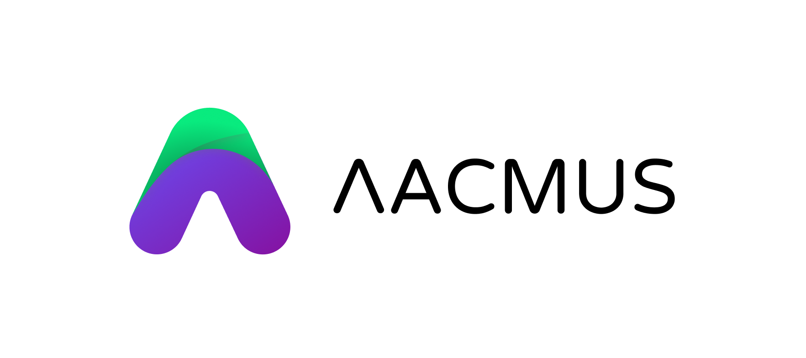
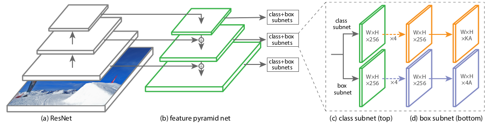
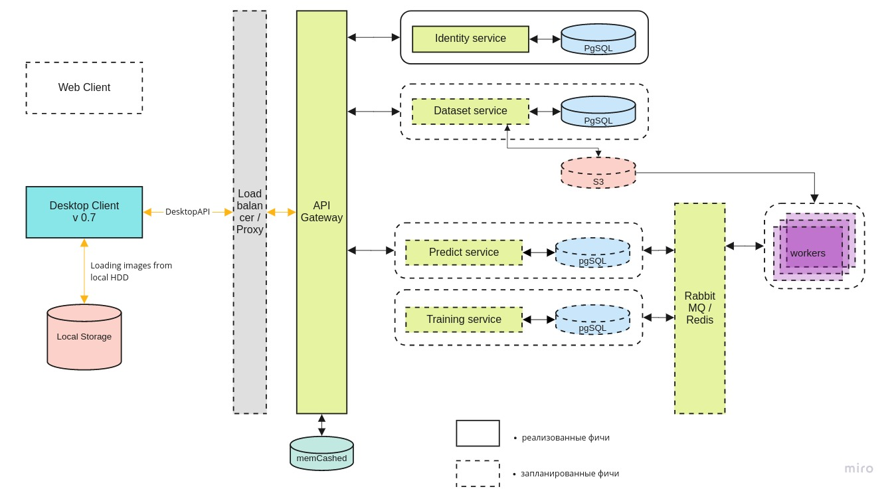

# Проект Lacmus: как компьютерное зрение помогает спасать потерявшихся людей  
  

### Введение  

Всем привет!  

Возможно, вы уже слышали про инициативу Machine Learning for Social Good (**#ml4sg**) сообщества [Open Data Science](https://ods.ai/). 
В её рамках энтузиасты на бесплатной основе применяют методы машинного обучения для решения социально-значимых проблем. 
Мы, команда проекта Lacmus (**#proj_rescuer_la**), занимаемся внедрением современных Deep Learning-решений для поиска людей, потерявшихся вне населённой местности: в лесу, поле и т.д..

По приблизительным оценкам, в России каждый год пропадает более ста тысяч человек. Ощутимую часть из них составляют люди, заблудившиеся вдали от человеческого жилья. Некоторые из потерявшихся, к счастью, выбираются сами, для помощи другим мобилизуются добровольческие поисково-спасательные отряды (ПСО). Наиболее известным ПСО является, пожалуй, Лиза Алерт, но хочется отметить, что он отнюдь не единственный.

Основными способами поиска на данный момент, в XXI-ом веке, является пешее прочёсывание окрестностей с применением технических средств, которые зачастую не сложнее сирены или гудящего маяка. Тема, конечно, актуальная и горячая, порождает много идей по использованию в поисках достижений научно-технического прогресса; некоторые из них даже воплощаются в виде прототипов и тестируются на специально организованных конкурсах. Но лес - это лес, и реальные условия поисков вкупе с ограниченностью материальных ресурсов делают эту проблему сложной и пока ещё очень далёкой от полного решения.  
Для осмотра больших участков территории в последнее время спасатели все чаще применяют беспилотные летательные аппараты (БПЛА), фотографирующие местность с высоты 40-50м. С одной поисково-спасательной операции (ПСО) получается несколько тысяч фотографий, которые на сегодняшний день добровольцы отсматривают вручную. Понятно, что такая обработка - это долго и неэффективно. Через два часа такой работы волонтеры устают и не могут продолжать поиск, а ведь от его скорости зависит здоровье и жизнь людей.  

Совместно с поисково-спасательными отрядами мы занимаемся разработкой программы для поиска пропавших людей на снимках, сделанных с БПЛА. Как специалисты по машинному обучению, мы стараемся сделать поиск автоматическим и быстрым.

### Аналогичные решения для БПЛА    

Несправедливо было бы утверждать, что Lacmus - единственный проект, разрабатываемый в данном направлении. Однако складывается впечатление, что он - единственный, разрабатываемый в тесном взаимодействии с ПСО, и ориентированный на их насущные потребности и возможности. Некоторое время назад был проведен конкурс "Одиссея", в котором разные команды соревновались в формировании лучшего решения для поиска и спасения людей, в том числе с помощью БПЛА. Находясь на начальной стадии разработки, мы присутствовали на этом конкурсе не в качестве участников, а в качестве наблюдателей. Cопоставив результаты конкурса, сведения о подобных проектах и наш опыт общения с такими ПСО как Лиза Алерт, Сова, Экстремум, хочется отметить проблемы, свойственные многим аналогам:  

- Стоимость внедрения. Некоторые команды из конкурса "Одиссея" занялись разработкой "инноваций": собственных дронов и БПЛА. Но надо понимать, что ПСО в России обычно работают на некоммерческой основе, и оснащать операторов дронов машинами стоимостью  от 1 000 000 рублей - это слишком дорого. К тому же, мало просто произвести летательный аппарат, нужно наладить его обслуживание. Мелким компаниям сложно предложить решения за те же деньги, что и у суровых китайских конкурентов.

- Коммерческая направленность многих решений. Нет, команда Lacmus не видит ничего плохого в бизнес-проектах. Но поиск потерявшихся в лесу людей - довольно специфичная задача, не всякую коммерческую разработку удастся в нее встроить. Вы можете сделать прекрасный дрон и воткнуть туда нейроночку, распознающую сельскохозяйственные культуры, однако для поиска людей в лесу силами добровольческих поисковых отрядов такой проект вряд ли пригодится: тут нужно максимально дешевое, но эффективное решение. Дорогие мультиканальные камеры здесь не подойдут. Только RGB, только хардкор. По этим же причинам отпадают и тепловизоры: дешевые модели имеют очень низкое разрешение. (И в целом тепловизоры здесь  неэффективны, потому что замерзший в лесу человек не излучает тепла.)

- Закрытость существующих разработок. Все известные нам решения являются закрытыми и проприетарными. Но проблема слишком сложна, чтобы решать её небольшой кучкой людей, а не пытаться привлечь всех готовых помочь. Поэтому мы и разрабатываем полностью Open Source-решение: странно думать, что тема, привлекающая такое количество работающих "в полях" добровольцев, не будет настолько же интересна IT-специалистам.

- Отсутствие свободы распространения. Добровольческие ПСО зачастую не централизованы, работающие подходы и приложения передаются из рук в руки, ПО с лицензируемыми копиями тут не подойдёт. Именно по этому мы в том числе выбрали стратегию открытого кода и открытого распространения, чтобы любой человек мог скачать наше решение и использовать его. Команда Lacmus выступает за открытую науку и открытый код.

- Популярные архитектуры нейросетей, используемые в известных нам решениях - YOLO, SSD, VGG - имеют хорошие метрики качества на публичных датасетах вроде ImageNet, но плохо работают на снимках в нашей, довольно специфичной, доменной области. (О выборе архитектуры нейросети, испробованных вариантах и особенностях используемой в итоге - ниже.)

- Практически никто не использует возможности по оптимизации моделей для инференса. В районах поиска часто нет выхода в интернет, поэтому нужно обрабатывать полученные снимки локально. Большинство спасателей пользуются ноутбуками с маломощными GPU, или вовсе без них, запуская нейросети на обычных CPU. Легко посчитать, что если на обработку одного снимка тратится в среднем 10 секунд, 1000 снимков будут обрабатываться около 3 часов. Тут, можно сказать, важна каждая секунда.

### Подготовка данных  

Казалось бы, если каждая поисковая операция с использованием БПЛА приносит тысячи фотографий, массив накопленных данных должен быть огромен - бери и обучай. Не всё оказалось так просто, потому что:

- Нет централизованного хранилища для размеченных данных. Снимки, полученные в ходе поисковых операций, в дальнейшем никак не используются и не обрабатываются.

- Полученные данные при этом очень несбалансированные. На один снимок с найденным человеком приходится несколько тысяч "пустых" фотографий. Поскольку информация о просмотренных снимках нигде не фиксируется, чтобы найти среди них нужные, надо второй раз проделать огромный объём работы - уже силами маленькой команды,  не имеющей "намётанных глаз".

- Каждое изображение, само по себе тоже "несбалансированное": искомый человек занимает на нём мизерную часть всей площади снимка. Очевидно, что хорошая нейросетка должна уметь не только сказать, что на снимке, по её мнению, присутствует человек - она должна обвести конкретное место (т.е. выполнить задачу детектирования объектов, а не классификации изображений). Иначе оператор будет тратить лишнее время и силы на разглядывание, а так же может по ошибке отбраковать нужное фото. Но для этого и учиться нейросеть должна на размеченных данных, на фотографиях, где искомый объект отмечен с использованием специального ПО. Никто не будет заниматься этим во время поисковой операции - не до того. 

- Не учитывается статистика по позам, в которых находились найденные люди, время года, тип местности и другие особенности снимков. Такие данные очень бы пригодились для создания "синтетических" обучающих изображений при помощи постановочной съёмки, фоторедакторов или генеративных моделей - но для использования всего этого нужно понимать, как выглядит фотография с реально потерявшимся человеком. Сейчас при воссоздании таких фотографий приходится опираться на субъективный опыт экспертов-спасателей. 

- Помимо технических сложностей, возможны юридические препятствиями, накладывающими ограничения на право собственности полученных снимков. Зачастую, наши обращения за помощью в сборе данных вовсе остаются без ответов. Из-за отсутсвия таких данных, юридических проблем или банальной лени - неясно.

Таким образом, ценная информация никак не используется для обучения нейросетей, теряясь или оседая мёртвым грузом где-то на дисках и облачных хранилищах, вместо того, чтобы улучшать объём и качество обучающей выборки. Мы пишем сервис, который позволит, в том числе, загружать к нам ценные фото (о нём тоже ниже), но задач, как всегда больше, чем людей.

При этом на сегодняшний день в сети очень мало хороших (открытых) датасетов со снимками с БПЛА. Наиболее подходящий из найденных нами - это [Stanford Drone Dataset (SDD)](http://cvgl.stanford.edu/projects/uav_data/). Представляет собой снимки с высоты над кампусом университета, с отмеченными объектами класса "Pedestrian" (пешеход), совместно с велосипедистами, автобусами и машинами. 
Несмотря на схожий угол съёмки, сфотографированные пешеходы и окружение имеют мало общего с происходящим на наших снимках. Проведенные на данном датасете эксперименты показали, что метрики качества обученных на нём детекторов на наших данных показывают низкий результат. В итоге, мы сейчас используем SDD для обучения так называемого backbone, извлекающего верхнеуровневые фичи, а верхние слои приходится доучивать на изображениях нашей доменной области.

Именно поэтому мы сначала долго общались с различными поисковиками и спасателями, пытаясь понять, как выглядит потерявшийся в лесу человек на снимке с высоты. В результате мы собрали уникальную статистику по 24 позам, в которых чаще всего находят без вести пропавших людей. Отсняли и разметили собственный набор данных - Lacmus Drone Dataset (LaDD), включающий в себя более в первой версии 400 снимков. Съемка велась преимущественно с помощью DJI Mavic Pro и Phantom с высоты 50 - 100 метров, разрешение снимков 3000х4000, размер человека в среднем 50х100 px. На данный момент у нас уже четвертая версия дата сета с 2 тысячами снимков, как реальных, так и "смоделированных". Мы продолжаем работу по пополнению набора данных и пятая версия не за горами!

 

По мере пополнения нашего датасета, мы пришли к необходимости разделять снимки по временам года. Дело в том, что модель, тренированная на зимних фото показывает результаты лучше, чем тренированная на всем датасете или на лете, или весне отдельно. Возможно, признаки на снежном фоне извлекаются лучше, чем на зашумленной траве.
В то же время, при обучении только на зимних снимках количество ложных срабатываний (false positive) возрастает. Видимо, снимки разных сезонов представляют собой слишком разные ландшафты (домены) и нейросеть оказывается не в состоянии их обобщить. С этим ещё предстоит разобраться, и пока нам видится два способа:

- Сделать много "маленьких" сеточек и учить их для разных доменов отдельно (для зимы одна, для лета другая... Можно кроме времен года разбивать еще и по местности: например, одна модель для средней полосы и равнин, другая - для юга и так далее).

- Многократно увеличить наши данные и пытаться обучить модель сразу на все домены. Основываясь на [этой](https://habr.com/ru/company/yandex/blog/431108/) статье от Яндекса (Яндекс, спасибо, что ты есть), мы решили попробовать данный вариант. Поэтому, возможно, у нас скоро появятся GAN-ы. 

### Процесс обучения  

Характер наших снимков значительно отличается от изображений популярных датасетов вроде ImageNet, COCO и т.д. Из-за этого разрабатываемые и тестируемые на данных наборах архитектуры нейросетей могли плохо подходить под наши задачи, поэтому было необходимо провести исследование применимости популярных типов нейросетей. Мы брали модели, предобученные на ImageNet, дообучали их на Stanford Drone Dataset, после чего "замораживали" бэкбоны, и остальные части детекторов тренировали уже непосредственно на наших снимках. Лучшие метрики представлены в таблице:  

Тип | mAP (зима)| mAP (лето)| Время работы для картинки 3000x4000 px, c (CPU \ GPU)
--- | --- | --- | :---:
SSD | 0.56 | - |  0.07 / 0.007
YOLOv3 | 0.72 | 0.23 |  0.07 / 0.009
DarkNet (ResneXt18) | 0.89 | 0.21 | 0.4 / 0.04
RetinaNet (mobileNetv2) | 0.67 | 0.22 | 0.03 / 0.003
**RetinaNet (ResNet50)** | **0.91** | **0.68** |  **1.4** / **0.04**

Помимо цифр в вышеприведённой таблице, следует обратить внимание на такую особенность снимков Lacmus Drone Dataset, как большой дисбаланс классов: отношение площади фона к площади прямоугольного анкора с искомымым объектом составляет несколько тысяч.
При обучении детектора это влечет за собой две проблемы:  

- Большинство регионов с фоном не несут никакой полезной информации.  
- Регионы с объектами ввиду их малой численности так же не вносят существенного вклада в обучение весов.

Чтобы как-то обойти эти проблемы, использовались различные схемы обучения, настройки сети и составления обучающих выборок.

Одна из протестированных архитектур нейросетей, RetinaNet, направлена как раз на снижение негативных последствий большого дисбаланса классов. Создатели RetinaNet проектировали её для увеличения точности one-stage detectors (покрывающих снимок густой сетью предопределённых прямоугольников-анкоров и потом выбирающих те, что лучше всего охватывают объект) по сравнению с более качественными, но медленными two-stage detectors (обучающимися вначале находить регионы-кандидаты, потом уточнять их положение). С точки зрения авторов статьи про RetinaNet, one-stage detectors проигрывают в точности именно из-за дисбаланса, порождаемого большим количеством пустых анкоров. На фоне данного преимущества наш выбор был сделан в пользу именно RetinaNet с бэкбоуном ResNet50.     

Архитектура этой сети [была представлена](https://arxiv.org/abs/1708.02002) в 2017 году. Главная особенность RetinaNet, позволяющая бороться с негативным влиянием дисбаланса классов при обучении - это оригинальная функция потерь **Focal Loss**.

$$
FL(p_t) = − (1 − p_t)^γ log(p_t)
$$

$$
p_t =
\begin{cases}
  p, if y = 1,
  1 − p otherwise
\end{cases}
$$

Где *p* - это оценённая моделью вероятность содержания в области искомого объекта (попросту говоря, выход нейросети, если он приводится к промежутку [0, 1]).

В других доменных областях loss-функция, как правило, должна быть робастной к нетипичным экземплярам (hard examples), являющимся скорее всего выбросами; их влияние влияние на обучение весов должно быть сокращено. В Focal Loss наоборот, снижается влияние часто встречающегося фона (inliers, easy examples), а наибольшее влияние при обучении весов RetinaNet оказывают редко встречающиеся объекты. Делается это за счёт вот этой части формулы:

$$
(1 − p_t)^γ
$$

Коэффициент γ в показателе степени определяет "вес" hard examples в суммарной функции потерь. 

В процессе обучения RetinaNet функция потерь вычисляется для всех рассматриваемых ориентаций областей-кандидатов (анкоров), со всех уровней масштабирования изображения. Всего - около 100k областей для одного изображения, что сильно отличается от подходов эвристической выборки (RPN) или поиска редких экземпляров (OHEM, SSD) с выбором небольшого количества областей (около 256) для каждого минибатча. Значение Focal loss вычисляется как сумма значений функции для всех анкоров, нормализованных по отношению к анкорам, содержащим искомые объекты. Нормализация производится только по ним, а не общему числу, поскольку подавляющее большинство анкоров - это легко определяемый фон, с незначительным вкладом в общую loss-функцию.

Структурно RetinaNet состоит из бэкбоуна и двух дополнительных сетей классификации (Classification Subnet) и определения границ объекта (Box Regression Subnet).

В качестве бэкбоуна используется так называемая **Feature Pyramid Network, FPN**, работающая поверх одной из общеиспользуемых сверточных нейросетей (например, ResNet50). FPN имеет дополнительные боковые (lateral) выходы со скрытых слоев свёрточной сети, формирующие уровни пирамиды с разным масштабом. Каждый уровень дополняется "знаниями сверху" (top-down pathway), т.е. информацией с более высоких уровней, имеющих меньший размер, но содержащих сведения об областях большей площади. Выглядит это как исскуственное увеличение (например, простым повтором элементов) более "свёрнутой" карты признаков до размера текущей карты, их поэлементное суммирование и передача как на более низкие уровни пирамиды, так и на вход остальных подсетей (т.е. в Classification Subnet и Box Regression Subnet)
Это позволяет выделить из исходного изображения пиримиду признаков в разных масштабах, на которых могут быть обнаружены как большие, так и мелкие объекты.
FPN используется во многих архитектурах, улучшая детекцию объектов разного масштаба: RPN, DeepMask, Fast R-CNN, Mask R-CNN и т.д.  
Более подробно про FPN можно почитать в [оригинальной статье](https://arxiv.org/pdf/1612.03144.pdf).

В нашей сети, как и в оригинальной, использована FPN с 5-ю уровнями, нумеруемыми с P3 по P7. Уровень Pl имеет разрешение в 2^l раз меньшее, чем входное изображение (не будем вдаваться в подробности, с каких точек ResNet они берутся - в этом чёрт ногу сломит).
Все уровни пирамиды имеют одинаковое количество каналов С = 256 и количество анкоров А около 1000 (зависит от размера изображений).  

Анкоры имеют площади от [16 х 16] до [256 x 256] для каждого уровня пирамиды от P3 до P7 соответсвенно, с шагом смещения (strides) [8 - 128] px. Такой размер позволяет анализировать мелкие обьекты и некоторую окрестность вокруг. Например ветка, если не учитывать окружающую ее действительность очень похожа на лежащего человека.  
В оригинальной FPN используются три значения соотношений сторон (aspect ration) анкоров (1:2, 1:1, 2:1); авторы RetinaNet для более плотного покрытия добавили по три масштаба каждого из этих aspect ration [2^0, 2^1/3, 2^2/3]. Применение 9-ти типов анкоров на каждом уровне позволяет находить объекты, имеющие на исходном изображении длину/ширину от 16 до 400 px.

**Classification Subnet** предсказывает вероятность присутствия для каждого из К классов в заданном анкоре.
По сути это простая полносвязная сеть (Fully ConvNet, FCN), присоединенная к каждому из уровней FPN.
Ее параметры на различных уровнях пирамиды одинаковы, и архитектура ее довольно простая:  
- на вход подается карта признаков (W x H x C),
- 3х3 свертка с С фильтрами,
- ReLU активация,
- 3х3 свертка с (К х А) фильтрами,
- сигмоид-активация последнего слоя.  

Итого на выходе этой сети формируется вектор длиной К x A, где K - количество разных классов. В нашем случае используется только один класс - это Pedestrian.

**Box Regression Subnet** позволяет уточнить 4-компонентный вектор координат анкора под реальный размер объекта.
Это небольшая полносвязная сеть, прикрепленная к каждому из уровней FPN, которая работает независимо от Classification Subnet.
Их архитектуры почти одинаковы, за исключением того, что при обучении минимизируется вектор размером (4 х А) - для каждого анкора:
$$
(\Delta x_min, \Delta y_min, \Delta x_max, \Delta y_max)
$$

Считается, что анкор содержит объект, если IoU (Intersection over Union) с реально содержащей объект областью > 0.5. В этом случае y_i назначается 1, иначе 0.
Такой подход позволяет сократить вычислительные затараты при обучении детектора.

**Инференс** (детектирование объектов на изображении) заключается в вычислении forward функции бэкбоуна и двух подсетей.
Для повышения скорости классификация осуществляется только по наилучшим 1k областям, имеющим предсказанную вероятность выше 0,05.
На последней стадии детекции остаются только те области со всех уровней пирамиды, вероятность классификации для которых превышает threshold = 0,5.

Более подробно про архитектуру RetinaNet можно еще почитать [здесь](https://towardsdatascience.com/review-retinanet-focal-loss-object-detection-38fba6afabe4).

Естественно, мало кто реализует такие сложные архитектуры руками с нуля. Мы брали за основу OpenSource-библиотеку, предоставленную на Github пользователем fizyr: https://github.com/fizyr/keras-retinanet которую в последствии неоднократно дорабатывали.

### Оптимизация нейросети 

Для нас очень важна скорость работы сети, поэтому мы долго и упорно искали решения для того, чтобы выжать максимум из среднего ноутбука за 20-30 тысяч рублей. Вот лишь несколько подходов и автоматических фреймворков, которые мы попробовали:

- [Intel OpenVINO](https://software.intel.com/en-us/openvino-toolkit) - для оптимизации на CPU (в итоге мы скомпилировали нашу сеть, но по каким-то причинам эффекта это не дало). 
- [TensorRT](https://developer.nvidia.com/tensorrt) - для оптимизации на GPU (наша сеть не конвертировалась). 
- [PlaidML](https://github.com/plaidml/plaidml) - запускали нашу сеточку на Intel HD Graphics (!) (сеточка заработала но выйгрыш в скорости по сравнению c CPU получился очень маленьким). 
- [nGraph](https://www.intel.ai/ngraph/#gs.lriinb) - прироста в производительности не получили.

А еще...

- Nvidia Jetson
- Corral Edge TPU

В результате мы собрали свою версию tensoflow 1.14 с оптимизациями для CPU с поддержкой AVX используя различные хитрости и библиотеки от Intel вроде nndl. 
Не обошли стороной мы и старые процессоры без AVX инструкций (в основном выпускались до 2012 года) и теперь мы можем сказать, что наше решение работает даже на *Core 2 Duo*! 
Также мы [исправили](https://github.com/lacmus-foundation/lacmus/wiki/%D0%94%D0%BB%D1%8F-%D1%80%D0%B0%D0%B7%D1%80%D0%B0%D0%B1%D0%BE%D1%82%D1%87%D0%B8%D0%BA%D0%BE%D0%B2:-%D0%A4%D1%83%D0%BD%D0%BA%D1%86%D0%B8%D1%8F-OpenCV-LUT) изначально неэффективную аугментацию данных по аналогии с кодом библиотеки Albumentations.

Сухая статистика:

| **Оборудование**                                             | **Время работы для картинки 3000x4000 px, c** |
| ------------------------------------------------------------ | --------------------------------------------- |
| i5-3337U (2x cores / 4x threads @ 1,80 Hz) AVX               | 2.3                                           |
| i5-6200U (2x cores / 4x threads @ 2,30 Hz) AVX2              | 1.7                                           |
| i7-8750H (8x cores / 12x threads @ 2,20 Hz) AVX2             | 0.8                                           |
| i7-9700 (8x cores / 8x threads @ 3.6Нz) AVX2                 | 0.5                                           |
| NVIDIA GeForce GTX 950M (2gb vRAM)                           | 0.3                                           |
| NVIDIA GeForce GTX 2080Ti (11gb vRAM)                        | 0.02                                          |
| **Core 2 Duo E8400 (2x cores / 2x threads @ 3,0 Hz) no avx** | **7**                                         |

### Production

**Модель нейронной сети и docker**

С учетом пожеланий и запросов спасателей из Лиза Алерт нами разработано desktop-приложение. В действительности мы хотели максимально упростить работу пользователя и облегчить установку необходимых библиотек. Поставить Nvidia Cuda и CuDNN или сделать кастомую сборку TensorFlow - не самая простая задача для пользователя. К тому же, мы хотели, чтобы пользователю не пришлось заботится установкой python и настраиванием зависимостей. Мы хотели что-то компактное, что сокроет от пользователя всю сложность настройки и установки библиотек. И мы нашли такое решение - это Docker. В контейнере мы разворачиваем локальный маленький web-сервер с нейронкой на борту и установленными зависимостями. Если мы вдруг захотим обновить модель, то нам всего лишь нужно будет скачать новую версию docker-образа. В добавок мы отделяем таким образом GUI и модель. Так GUI может обращаться не к локальному серверу, а к удаленному, в случае если, например, у пользователя будет хороший канал связи. К тому же Docker предоставляет удобное API, которым можно автоматически управлять прямо из GUI, поэтому для пользователя все останется таким же прозрачным. Помимо этого, Docker предоставляет свой репозиторий, где можно хранить разные версии образов и не заботиться о сервере с моделями.

**Пользовательский интерфейс или С# творит чудеса**

Теперь об интерфейсе. В процессе разработки приложения нам были важны 3 критерия:

- Быстрота разработки
- Кроссплатформенность
- Низкое потребление ресурсов

После некоторых поисков в интернете мы наткнулись на [этот доклад с конференции dotnext](https://www.youtube.com/watch?v=8qzqweimcFs&t=8s). Хм! Это что-то новенькое! Какой-то очень молодой фреймворк? "Интересно его потрогать", - решили мы и не прогадали! GUI написан на С# фреймворке AvaloniaUI, что позволяет запускать ее x64 OS Win10, Linux и Mac.

AvaloniaUI  - это молодой, но очень мощный и быстрый фреймворк. По своей концепции он очень похож на WPF, что позволяет переносить на него приложения, не особо изменяя код.
Он быстр и эффективен, 2D-графика в нем рисуется быстрее и потребляет меньше ресурсов, чем у WPF. Также тут есть некоторые плюшки, улучшающие оригинальный WPF.

Что касается внутреннего устройства, то тут применяется библиотека SkiaSharp для отрисовки графики и GTK (для Unix систем). Также ведётся разработка X11 рендера.
Всё это позволяет рисовать интерфейс везде, где угодно, даже в буфере консоли(!).
Если бы .Net Core можно было бы запустить в Bios'е, то AvaloniaUI отрисовала бы там модный геймерский интерфейс как на крутых материнских платах.

AvaloniaUI набирает популярность и является открытым фреймворком, хотя все еще находится в бете, и в этом фремворке присутствуют баги. Но разработчики его постоянно улучшают и дополняют, и по состоянию на конец 2019 года мы можем заявить, что на нем уже можно писать небольшие коммерческие решения. Если вы знакомы с WPF и C# - то вам определенно стоит попробовать. К достоинствам можно также отнести низкое потребление ресурсов интерфейсом (что не скажешь об electron), а значит, мы выигрываем несколько мегабайт ОЗУ для нашей сеточки.

*вот на что он способен...*

Также хочется сказать, что у проекта довольно отзывчивая поддержка, и разработчики быстро отвечают на issue. Те, кому интересно, могут почитать [нашу статью](https://gosha20777.github.io/dotnet/2019/05/24/avalonui/), еще [эту](https://habr.com/ru/post/447152/) статью. И [эту](https://habr.com/ru/post/438920/). 

Для полного понимания этой концепции стоит посмотреть [выступление](https://youtu.be/8qzqweimcFs) Никиты Цуканова [@kekekeks](https://github.com/kekekeks).
Он является разработчиком этого фреймворка, отлично разбирается в нем и в .NET в общем.

**Бекенд**

Помимо desktop-приложения нами разрабатывается mlOps инфраструктура для проведения экспериментов и поиску лучшей архитектуры нейросети в облаке.  С помощью серверной части мы хотим:

- агрегировать данные и централизованно их хранить
- автоматизировать процесс обучения нейронной сети, создать окружение для исследований и предоставить доступ к нему другим
- предоставлять доступ к облаку поисково-спасательным отрядам, чтобы они при необходимости тоже могли использовать накопленные данные;

Общая архитектура системы выглядит приблизительно таким образом:

  

**Desktop-client** может работать как с локальной версией docker-контейнера, так и последней версией на центральном сервере, через REST API.  
**Identity** микросервис обеспечивает доступ к серверу только авторизованных пользователей.  
**Dataset** сервис служит для хранения как самих изображений, так и их разметки.  
**Predict** сервис позволяет осуществлять быструю обработку большого количества изображений при наличии широкого канала у пилотов.  
**Training** сервис нужен для тестирования новых моделей и дообучения существующих по мере поступления новых данных.  
Управление очередью задач осуществляется с помощью RabbitMQ / Redis.  

GPU-сервер предоставил нам один из участников проекта, однако мы с удовольствием будем сотрудничать и с новыми партнерами дабы не "колхозить" серверов.  

### Итого  

За прошедший 2019 год участники Lacmus Foundation:  

- отсняли и разметили уникальный dataset, последняя версия которого включает в себя более 4000 снимков.

- попробовали ряд различных DL подходов и выбрали лучший,

- подобрали лучшие гиперпараметры нейронной сети и обучили ее на собственных уникальных данных для наиболее точного распознавания;

- разработали кросс-платформенное приложение для операторов БПЛА с возможностью использования нейронной сети на местах ПСР при работе оффлайн;

- оптимизировали работу нашей нейронной сети для работы на бюджетных и маломощных портативных компьютерах.

Наша программа готова к использованию в условиях реальных ПСР и прошла тестирование на генеральных прогонах.
На открытых участках типа «поле» и «бурелом» обнаружены все тестовые «потерявшиеся».
На данный момент, лучшие показатели метрики mAP нашей нейронной сети "Лакмус" – 94%.
Результаты по найденным объектам нейронной сетью "Лакмус" заинтересовали добровольческие поисково-спасательные отряды со всей России.
На счету нашей программы уже не одна спасенная жизнь.  

 В следующем году мы планируем:  

- найти партнера для надежного хостинга инфраструктуры;
- реализовать веб-интерфейс и mlOps;
- сформировать большой синтетический датасет на движке UE4 или с помощью GANов;
- запустить In Class соревнование на Kaggle для всех желающих прокачать свои DL/CV навыки и поиска наилучших SOTA решений;
- добавить в нашу retinanet еще больше реализаций бекбоунов и вариаций этой архитектуры.  

Нам очень не хватает рабочих рук для того, чтобы реализовать эти планы, поэтому мы будем рады всем независимо от уровня и направления подготовки.

Ведь если вместе мы сможем спасти еще хотя бы одного человека, то все приложенные усилия будут не зря.

### Как помочь проекту

Мы - open sourse проект, и активно примем всех желающих!

Вот ссылки на наши репозитори на github:

- https://github.com/lacmus-foundation - наше сообщество
- https://github.com/lacmus-foundation/lacmus - наша нейронная сеть
- https://github.com/lacmus-foundation/lacmus-app - наше GUI приложение

**Если вы разработчик** и хотите присоединиться к проекту - вы можете написать Перевозчикову Георгию Павловичу, @gosha20777 во всех соцсетях, gosha20777@live.ru или присоедениться к проекту прямо из ODS канала в slack (если вы там есть). Мы любим активных людей! Нам нужны

- ML разработчики
- C# / go / python разработчики
- Фронтенщдики
- Бекендщики
- Просто активные люди любых направлений! Мы всегда будем вам рады!

**Если вы не связаны с разработкой** вы тоже можете помочь проекту

- Вы можете помочь нам с написанием статей
- Вы можете помочь нам с написанием пользовательской документации и wiki (и поисправлять там грамматические ошибки)))
- Вы можете побыть в роли product менеджера и позаполнять задачки в trello
- Вы можете предложить нам идею
- Вы можете распространить этот пост

### Вместо заключения

Данная статья писалась разными людьми из нашей команды, а потому манера изложения может отличаться от пункта к пункту. Мы все разные но обедняет нас одно - нам всем интересно пробовать что-то новое, экспериментировать и создавать. Мы все хотим чтобы мир IT технологий был открытым и полезным для многих людей, чтобы он помогал человечеству.

### Благодарности

- Самым активным участникам ODS в канале #proj_rescuer_la : @Kseniia @balezz @ei-grad @dartov @sharov_am @Palladdiumm.
- Участникам проекта вне ODS: Мартынова Виктория Викторовна (организация проекта, сбор и разметка данных), Шуранков Денис Петрович (организация сбора данных), Перевозчикова Дарья Павловна (разместила около 30% всех фото).
- Программистам из AvaloniaUI - лучшего фреймверка на .NET: @worldbeater @kekekeks @lary9896
- Операторам БПЛА из отряда Лиза Алерт за снимки и набор данных: Партызан, Вантеич, Севыч, Калифорния, Тарекон, Евген, ГБ.
- Админам ODS за организацию самого крутого сообщества: @natekin, @Sasha, @mephistopheies.  

Руководитель проекта, Перевозчиков Георгий Павлович, @gosha20777.

Этот список не полный, в действительности он гораздо больше.

### P.S. "А вы знаете про нейросеть от Билайна?"

Честно говоря, не очень хочется задевать эту (скользкую) тему, но она продолжает задевать нас, так что делать вид, что мы в танке, не получится. Да, мы знаем про нейросеть от Билайна. По отзывам сотрудничающих с нами пилотов - работает хуже нашего варианта и только на high-end платформах. По сведениям разработчиков от самого Билайна - проект заморожен и сейчас не разрабатывается. С позиций здравого смысла - новости в духе "Билайн первым в России разработал такую-то нейросеть" истине вряд ли соответсвуют. Мало кто занимается даже реализацией архитектур, спроектированных лабораториями вроде Facebook Research или Google Brain, не то что созданием своей. Чаще всего речь просто об адаптации общедоступной OpenSource-библиотеки под нужды своей предметной области. Насколько часто открытые библиотеки используются в коммерческом российском ПО, знают все, кто это ПО разрабатывает. В большинстве своём тут нет даже нарушения лицензии; но вот выдавать достижения международного OpenSource за целиком свою разработку и делать на этом громкий пиар - как минимум, некрасиво. Есть даже основания предполагать, что наши наработки тоже были использованы - в частности, в [этой геймификации](https://alert.lenta.ch/) засветились фотографии из датасета Lacmus. Также у нас есть основания полагать что одним датасетом тут не ограничились.

Чем плоха данная ситуация для нас в первую очередь, так это тем, что "нейросетка Билайна" теперь раскручена до невозможности. Когда её упоминают, нельзя понять - действительно ли речь про неё, или про наше приложение, или вообще про чей-то ещё вариант. В условиях децентрализованности, слабой управляемости ПСО и малом количестве каналов обратной связи, любая информация о распространённости и качестве работы Lacmus была бы полезна, так же как и об аналогичных разработках - но шумиха вокруг Билайна заслонила собой всё.

Поэтому, наша просьба к сообществу - во-первых, говорить "нейросеть Билайна" только когда на 100% уверены, что это именно она, а во-вторых, читать лицензии открытого ПО и честно указывать авторство.
Всем быть находчивыми и никогда не теряться!

*Видео демонстрация работы на десерт. Pre early alpha версия. Для тех кто дочитал до конца. Февраль 2019.*

