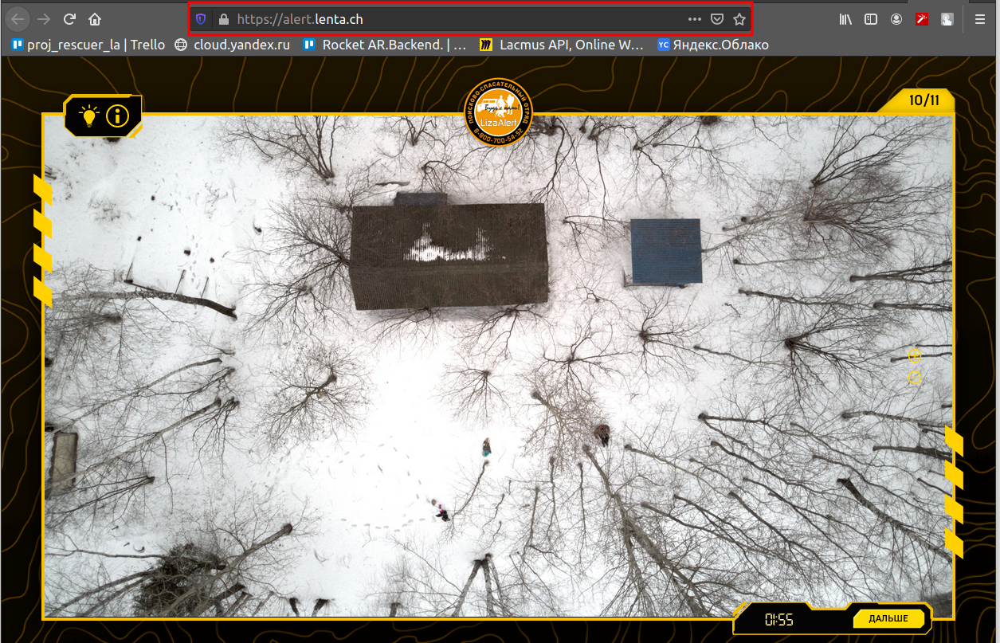
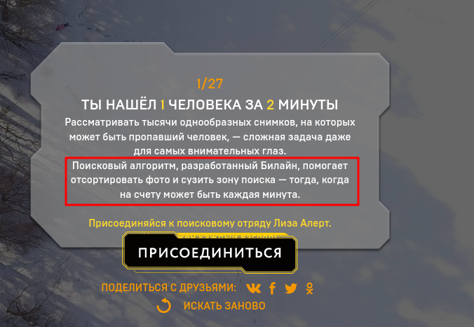

# Проект Lacmus: как компьютерное зрение помогает спасать заблудившихся людей  
  

### Введение  

Всем привет!  

Возможно, вы уже слышали про инициативу Machine Learning for Social Good (**#ml4sg**) сообщества [Open Data Science](https://ods.ai/). В рамках неё энтузиасты на бесплатной основе применяют методы машинного обучения для решения социально-значимых проблем. Мы, команда проекта Lacmus, занимаемся внедрением современных Deep Learning-решений для поиска людей, потерявшихся вне населённой местности: в лесу, в поле.

По приблизительным оценкам, в России каждый год пропадает более ста тысяч человек. Ощутимую часть из них составляют люди, заблудившиеся вдали от человеческого жилья. Некоторые из потерявшихся, к счастью, выбираются сами, для помощи другим мобилизуются добровольческие поисково-спасательные отряды (ПСО). Наиболее известным ПСО является, пожалуй, Liza Alert, но хочется отметить, что он отнюдь не единственный.

Основными способами поиска на данный момент, в XXI-ом веке, является пешее прочёсывание окрестностей с применением технических средств, которые зачастую не сложнее сирены или гудящего маяка. Тема, конечно, актуальная и горячая, порождает много идей по использованию в поисках достижений научно-технического прогресса; некоторые из них даже воплощаются в виде прототипов и тестируются в специально организованных конкурсах. Но лес - это лес, и реальные условия поисков вкупе с ограниченностью материальных ресурсов делают эту проблему сложной и ещё очень далёкой от полного решения.  
Для осмотра больших участков территории в последнее время спасатели все чаще применяют беспилотные летательные аппараты (БПЛА), фотографирующие местность с высоты 40-50м. С одной поисково-спасательной операции (ПСО) получается несколько тысяч фотографий, которые на сегодняшний день добровольцы отсматривают вручную. Понятно, что такая обработка это долго и неэффективно, через два часа такой работы люди устают и не могут продолжать поиск - а ведь от его скорости зависит здоровье и жизнь людей.  

Совместно с поисково-спасательными отрядами мы занимаемся разработкой программы для поиска пропавших людей на снимках, сделанных с БПЛА. Как специалисты по машинному обучению, мы стараемся сделать поиск автоматическим и быстрым.

### Аналогичные решения для БПЛА    

Оставаясь в курсе новостей в данной области, мы не испытываем иллюзий, что являемся единственной командой, ведущей подобные разработки. Однако складывется впечатление, что наша отличительная особенность - тесное взаимодействие с ПСО и ориентированность на их насущные потребности и возможности. Некоторое время назад был проведен конкурс "Одиссея", в котором разные команды представили свои решения для поиска и спасения людей, в том числе с помощью БПЛА. Находясь на начальной стадии разработки, мы присутствовали на этом конкурсе исключительно в качестве наблюдателей. Но сопоставляя результаты конкурса и наш опыт общения с такими ПСО как Liza Alert и Сова, а также полученными в ходе разработки знаниями, хочется отметить проблемы, свойственные многим проектам-аналогам:  

- Снимки, полученные в ходе поисковых операций, в дальнейшем никак не используются.
Все полученные фотографии просто складываются в одну папку, никто их не размечает.
При таком подходе очень тяжело использовать полученный опыт, потому что данные сами по себе очень несбалансированные.  
На один снимок с найденным человеком приходится несколько тысяч "пустых" фотографий.
- Не учитывается статистика по позам, в которых находились найденные люди, время года, тип местности и другие особенности снимков.  
Вообще, на сегодняшний день очень мало хороших датасетов со снимками с БПЛА.
Самый известный - это Stanford Drone Dataset, имеет подходящий класс изображений "Pedestrian", но эти пешеходы имеют мало общего с людьми на наших снимках.  
Проведенные эксперименты подтвердили: метрики качества нейросетевых детекторов, обученных на стэнфордском датасете, на наших данных оставляют желать лучшего. Именно поэтому мы сначала долго общались с различными поисковиками и спасателями чтобы понять в каких позах чаще всего находят людей. В результате чего у нас получилось 24 различных позы.
- Нет централизованного хранилища для размеченных данных.
Ценная информация никак не используется для обучения нейросетей, качество которых напрямую зависит от объема обучающей выборки.  
Помимо технических сложностей, мы столкнулись с юридическими препятствиями, накладывающими ограничения на право собственности полученных снимков. Мы обратились к различным ПРО с целью собрать данные (в частности речь идет о Лиза Алерт) но к сожалению таких ответов было очень мало. В результате чего мы сделали выводы о том что или такая статистика не собиралась или нам не захотели давать данные в силу каких-то внутренних, юридических вопросов.
- Мы не первые, кто пытается решить задачу поиска людей с помощью DL подходов.
Однако во всех известных нам решениях использованы популярные архитектуры нейросетей (YOLO, SSD, VGG), которые имеют хорошие метрики качества на публичных датасетах (ImageNet и др.), но плохо работают на наших снимках.
Для того, чтобы попробовать разные архитектуры и найти лучшее решение, требуется очень много времени и вычислительных мощностей.
- Практически никто не использует возможности по оптимизации моделей для инференса.
В районах поиска часто нет выхода в интернет, поэтому нужно обрабатывать полученные снимки локально.
Большинство спасателей пользуются ноутбуками с маломощными GPU, или вовсе без них, запуская нейросети на обычных CPU.
Легко посчитать, что если на обработку одного снимка тратится в среднем 10 секунд, 1000 снимков будут обрабатываться около 3 часов.
Тут, как говорится, каждая секунда на счету.
- Дешевизна внедрения: многие команды из конкурса "одиссея" принялись разрабатывать "инновации" и собственные дроны и бпла. Однако стоит понимать что поисково-спасательные отряды в россии такие как известная Лиза Алерт, Сова, (ДОБАВИТЬ ОТРЯДЫ) часто работают на не коммерческой основе и оснащать операторов дронов машинами стоимостью 1 000 000 руб (и именно такие цены звучали на Одиссее) и выше слишком дорого. К тому же мало просто произвести дрон, нужно наладить его обслуживание а мелким компаниям сложно предложить конкурентные решения за те же деньги (да-да суровые китайцы они такие).
- Закрытость существующий решений: все существовавшие до этого решения и те решения которые возникали уже во время разработки нашего проекта являются закрытыми и проприетарными. Но проблема давольно сложна и ее невозможно решить небольгой кучкой людей, по этому мы разработываем полностью open sourse решение, чтобы любой человек имел возможность внести изменения в программный код, дополнить наш дата сет новыми фотографиями, помочь в их разметке, написать часть документации. Иными словами любой человек волен как то повлиять на развитие проекта.
- Коммерческая направленность многих решений. Нет, не подумайте, команда Лакмус не видит ничего плохого в бизнес проектах. Просто дело в том что поиск потерявшихся в лесу лююей - довольно специфичная задача. И не всякий коммерческий проект можно в нее встроить. Вы можете сделать прекрасный дрон и воткнуть туда нейроночку, распознающую сельскохозяйственные культуры, однако для поиска людей в лесу силами добровольческий поисковых отрядов такой проект вряд ли пригодится: тут нужно максемально дешевое но эффективное решение. Дорогие мультиканальные камеры тут не подойдут. Тлько RGB только хардкор. По этим же причинам отпадают и тепловизоры - дешевые модели имеют очень низкое разрешение и в целом тепловизоры не эффективны потому что замерзший в лесу человек не излучает тепла.
- Свобода распространения: поисково спасательные отряды особенно добровольческие зачастую не централизованы. Именно по этому мы в том числе выбрали стратегию открытого кода и открытого распространения, чтобы любой человек мог скачать наше решение и использовать его. Команда лакмус выступает за открытую науку и открытый код.

### Подготовка данных   

В первую очередь, мы собрали уникальную статистику по позам, в которых чаще всего находят без вести пропавших людей.
Отсняли и разметили уникальный Lacmus Drone Dataset (LaDD), первая версия которого включает в себя более 400 снимков (на данный момент у нас уже четвертая версия дата сета с 5 тысячами снимков).
Съемка велась преимущественно с помощью DJI Mavic Pro и Phantom с высоты 50 - 100 метров, разрешение снимков 3000х4000, размер человека в среднем 50х100 px.
Использованы как реальные снимки, так и "смоделированные", в которых несколько человек в разных позах и одежде имитировали потерявшихся.  

  

По мере пополнения нашего датасета, мы пришли к необходимости разделять снимки по временам года.
Дело в том, что если тренировать нейросеть на зимних фото, то mAP на всех остальных временах года получается на уровне 0.8 - 0.9. Если же для тренировки использовать летние или весенние снимки, то получается на лете до 0.9, но на зиме менее 0.6.
Видимо, признаки на снежном фоне извлекаются лучше, чем на зашумленной траве.

Лучшие метрики, полученные на зимних фото, представлены в таблице.  

Тип | mAP | FPS (GPU / CPU)
--- | --- | :---:
SSD | 0.56 |  15 / 150
YOLOv3 | 0.72 |  20 / 194
RetinaNet/mobileNetv2 | 0.67 |  32 / 300+
RetinaNet/ResNet50 | 0.91 |  1 / 45
DarkNet |   0.89 | 10 / 80
Unet | 0.96 | 0.5 / 20+

Однако стоит отметить что при таком подходе (обучение только на зимних снимках) количество ложных срабатываний (false positive) возрастает. Это происходит потому что у нас слишком разные ландшафты (домены). Земля в разных уголках нашей необъятной планеты выглядит по разному. В результате чего сеть не может обобщить все домены. Из этой ситуации можно выходить двумя способами:

- Сделать много "маленьких" сеточек и учить их для разных доменов отдельно (для зимы одна, для лета другя... можно кроме времен года бить еще и по местности: например отдельная медель для средней полосы и равнин, для юга другая и так далее).
- Многократно увеличить наши данные и попробывать обучить модель сразу на все домены. Основываясь на [этой](https://habr.com/ru/company/yandex/blog/431108/) статье от Яндекса (яндекс, спасибо что ты есть) мы решили попробовать этот вариант. У нас все еще существуют бескрайние просторы полей и разного вида лесов без людей и сейчас мы думаем над тем чтобы "исправить" этот недостаток. Поэтому возможно у нас скоро появятся GAN-ы.

### Процесс обучения  

Для бэкбоунов мы брали модели, предобученные на ImageNet, отрывали последний слой и дообучали на Stanford Drone Dataset. Детекторы обучались непосредственно на наших снимках. Но у нас возникла еще одна проблема.  
Все наши снимки имеют такую важную особенность как большой дисбаланс классов: отношение площади фона к площади искомого объекта (его прямоугольного анкора) составляет несколько тысяч.

Дисбаланс классов при обучении детектора влечет за собой две проблемы:  

- Большинство регионов, содержащих фон, не несут никакой полезной информации.  
- Регионы с объектами ввиду их малой численности не вносят существенного вклада в обучение весов сети в процессе обучения.  

Чтобы как-то обойти этих проблемы, использовались различные схемы обучения и составления обучающих выборок.
В итоге по соотношению точность / производительность на наших снимках лучше всех показала себя RetinaNet с бэкбоуном ResNet50.
Оригинальная архитектура RetinaNet [была представлена](https://arxiv.org/abs/1708.02002) в 2017 году.

Структурно RetinaNet состоит из бэкбоуна и двух дополнительных сетей классификации (Classification Subnet) и определения границ объекта (Box Regression Subnet).

В качестве бэкбоуна используется сверточная нейросеть, имеющая дополнительные выходы со скрытых слоев (**Feature Pyramid Network, FPN**).
Она позволяет выделить из исходного изображения пиримиду признаков в разных масштабах, на которых могут быть обнаружены как большие, так и мелкие объекты.
FPN используется во многих архитектурах, улучшая детекцию объектов разного масштаба: RPN, DeepMask, Fast R-CNN, Mask R-CNN и т.д.  
Более подробно про FPN можно почитать в [оригинальной статье](FPN).

В нашей сети, как и в оригинальной, использована FPN из ResNet50, с дополнительными выходами со слоев с 3 по 7,
Все уровни пирамиды имеют одинаковое количество каналов С = 256 и количество анкоров А около 1000 (зависит от размера изображений).  

Анкоры (границы объектов) имеют площади от [32 х 32] до [512 x 512] с шагом смещения (strides) [16 - 256] px на каждом уровне пирамиды признаков. Такой размер мы подобрали потому что зачастую приходится анализировать мелкие обьекты и некоторую окрестность вокруг. Например пветка, если не учитывать окружающую ее действительность очень похожа на лежащего человека.  
В оригинальной [FPN](https://arxiv.org/pdf/1612.03144.pdf) используются три значения ориентации анкоров (1:2, 1:1, 2:1).
В нашей RetinaNet для более плотного покрытия добавлено масштабирование анкоров [2^0, 2^1/3, 2^2/3].
Применение 9 анкоров на каждом уровне позволяет находить объекты c длиной / шириной от 32 до 813 px.

**Classification Subnet** предсказывает вероятность присутствия для каждого из К классов в заданном анкоре.
По сути это простая полносвязная сеть (Fully ConvNet, FCN), присоединенная к каждому из уровней FPN.
Ее параметры на различных уровнях пирамиды одинаковы, и архитектура ее довольно простая:  
- на вход подается карта признаков (W x H x C),
- 3х3 свертка с С фильтрами,
- ReLU активация,
- 3х3 свертка с (К х А) фильтрами,
- сигмоид активация последнего слоя.  

Итого на выходе этой сети формируется вектор длиной К, по количеству классов для разных объектов.
В нашем случае используется только один класс - это Pedestrian.

**Box Regression Subnet** позволяет более точно подогнать 4-вектор координат анкора под размер объекта.
Это небольшая полносвязная сеть, прикрепленная к каждому из уровней FPN, которая работает независимо от Classification Subnet.
Их архитектуры почти одинаковы, за исключением того, что при обучении минимизируется вектор размером (4 х А) - $ (\Delta x_min, \Delta y_min, \Delta x_max, \Delta y_max) $ для каждого анкора.  

Считается, что анкор содержит объект, если IoU (Intersection over Union) > 0.5.
В этом случае y_i назначается 1, иначе 0.
Такой подход позволяет сократить вычислительные затараты при обучении деетктора.

Главная особенность RetinaNet, позволяющая бороться с негативным влиянием дисбаланса классов при обучении Classification Subnet - это оригинальная функция потерь **Focal Loss**.

$$ FL(p_t) = − (1 − p_t)^γ log(p_t) $$    

$$
p_t =
\begin{cases}
  p, if y = 1,
  1 − p otherwise
\end{cases}
$$

Как правило, loss-функция должна быть робастной к выбросам (hard examples), сокращая их влияние на обучение весов.
В Focal Loss наоборот, снижается влияние наиболее часто встречающегося фона (inliers, easy examples), а наибольшее влияние при обучении весов RetinaNet оказывают выбросы - редко встречающиеся объекты.

В процессе обучения RetinaNet функция потерь вычисляется для всех ориентаций анкоров, на каждом слое FPN (всего около 10 000 областей для одного изображения).  
Это в корне отличается от известных подходов эвристической выборки (RPN) или поиска редких экземпляров (OHEM, SSD) с выбором небольшого количества областей (около 256) для каждого минибатча.  

Значение Focal loss вычисляется как сумма значений функции для всех областей, нормализованных по отношению к анкорам, классифицированных как "фон".
Нормализация производится только по анкорам, содержащим объект, а не общему их числу.
Этот подход как раз и позволяет избежать нежелательного влияния большого числа отрицательных классов.

**Инференс** (детектирование объектов на изображении) заключается в вычислении forward функции бэкбоуна и двух подсетей.
Для повышения скорости классификация осуществляется только по тем областям,  у которых y > 0,05.
При этом в оригинальном детекторе дополнительно накладывается ограничение на максимальное количество областей на изображении – не более 1000.
На последней стадии детекции остаются только те области, вероятность классификации для которых превышает threshold = 0,5.

Более подробно про архитектуру RetinaNet можно еще почитать [здесь](https://towardsdatascience.com/review-retinanet-focal-loss-object-detection-38fba6afabe4).

Для нас очень важна скорость работы сети. По этому мы долго и упорно искали решения для того чтобы выжать максимум из среднего ноутбука за 20-30 тыс р. Вот лишь несколько подходов и автоматических фейерверков которые мы побывали:

- Intel open VINO - для оптимизации на cpu (в итоге мы скомпилировали нашу сеть, но по каким то причинам эффекта это не дало)
- TensorRT - для оптимизации на gpu (наша сеть не конвертировалась)
- PlaidML - запускали нашу сеточку на intel hd rgaphics (!) (сеточка заработала но выйгрыш в скорости по сравнению просто инфернальном на cpu очень маленьким)
- nGraph - прироста в производительности не получили

А еще...

- nvidia jetson
- corral edge tpu

В результате мы собрали свою версию tensoflow 1.14 с оптимизациями для CPU с поддержкой AVX используя различные хитрости и библиотеки от intel вроде nndl. Не обошли стороной мы и старые процессоры без AVX инструкций (в основном выпускались до 2012 года) и теперь мы можем сказать что наша сеточка работает даже на *Core 2 Duo*! Также мы добавили [некоторые оптимизации](https://github.com/lacmus-foundation/lacmus/wiki/%D0%94%D0%BB%D1%8F-%D1%80%D0%B0%D0%B7%D1%80%D0%B0%D0%B1%D0%BE%D1%82%D1%87%D0%B8%D0%BA%D0%BE%D0%B2:-%D0%A4%D1%83%D0%BD%D0%BA%D1%86%D0%B8%D1%8F-OpenCV-LUT) связные со скоростью загрузки и аугментации данных c использованием OpenCV LUT и больших uint8-матриц. Это позволило ускорить загрузку данных в сеть в несколько раз, что значительно сократило время обучения и интерфейса модели.

Сухая статистика:

| **Оборудование**                                             | **Время работы для картинка 3000x4000 px, c** |
| ------------------------------------------------------------ | --------------------------------------------- |
| i5-3337U (2x cores / 4x threads @ 1,80 Hz) AVX               | 2.3                                           |
| i5-6200U (2x cores / 4x threads @ 2,30 Hz) AVX2              | 1.7                                           |
| i7-8750H (8x cores / 12x threads @ 2,20 Hz) AVX2             | 0.8                                           |
| i7-9700 (8x cores / 8x threads @ 3.6Нz) AVX2                 | 0.5                                           |
| NVIDIA GeForce GTX 950M (2gb vRAM)                           | 0.3                                           |
| NVIDIA GeForce GTX 2080Ti (11gb vRAM)                        | 0.02                                          |
| **Core 2 Duo E8400 (2x cores / 2x threads @ 3,0 Hz) no avx** | **7**                                         |

### Production

**Модель нейронной сети и docker**

С учетом пожеланий и запросов спасателей из Liza Alert, нами разработано desktop приложение. В действительности ты хотели максимально упростить работу пользователя и облегчить установку необходимых библиотек. Поставить nvidia Cuda и CuDNN или собрать кастомую сборку tensorflow не самая простая задача для пользователя. К тому же мы хотели чтобы пользователю не пришлось заботится установкой python и настраиванием зависимостей. Мы хотели что то компактное то что сокроет от пользователя всю сложность настройки и установки библиотек. И мы нашли это решение - это Docker. В контейнере мы разворачиваем лакальный маленький web сервер с нейронкой на борту и установленными зависимостями. Если мы вдруг захотим обновить модель то нам всего лишь нудно будет скачать новую версию docker образа. В добавок мы отделяем таким образом gui и модель и gui может обращаться не к локальному серверу а к удаленному, в случае если например у пользователя будет хороший канал связи. К тому же Docker предоставляет удобное API которым можно автоматически управлять прямо из GUI по этому для пользователя все останется таким же прозрачным. В добавок Docker предоставляет свой репозиторий где можно хранить разные версии образов и не заботиться о сервере с моделями.

**Интерфейс или С# творит чудеса**

Теперь об интерфейсе. В процессе разработки приложения нам были выжжены 3 критерия:

- Быстрота разработки
- Кроссплатформенность
- Низкое потребление ресурсов

После некоторых поисков в интернете мы наткнулись на статью. Хм! Это что то новенькое! Какой то очень молодой фреймверк? Интересно его потрогать, решили мы и не прогадали! GUI написан на С# фреймворке AvaloniaUI, что позволяет запускать ее x64 OS win10, linux и mac.

AvaloniaUI Это молодой но очень мощный и быстрый фреймверк. По своей концепции он очень похож на WPF, что позволяет переносить на него приложения не особо изменяя код.
Он быстр и эффективен, 2d графика в нем рисуется быстрее и потребляет меньше ресурсов, чем у WPF. Также тут есть некоторые плюшки, улучшающие оригинальный WPF.

Что касается внутреннего устройства то тут применяется библиотека SkiaSharp для отрисовки графики и GTK (для Unix систем). Также ведётся разработка X11 рендера.
Всё это позволяет рисовать интерфейс везде где угодно, даже в буфере консоли(!).
Если бы dotnet core можно было бы запустить в Bios е то avalonia ui отрисовала бы там модный геймерский интерфейс, как на крутых материнских платах.

AvaloniaUI набирает популярность и является открытым фреймверком хотя все еще находится в бете и в этом фремверке присутствуют баги. Но разработчики постоянно улучшают и дополняют фреймверк. И по состоянию на конец 2019 года мы можем заявить что на нем уже можно писать не большие коммерческие решения. Если вы знакомы с WPF и C# - то вам определенно стоит попробовать. К достоинствам можно также отнести низкое потребление ресурсов интерфейсом (что не скажешь об electron), а значит у мы выигрываем несколько мегабайт ОЗУ для нашей сеточки.

*вот на что он способен...*

Также хочется сказать что у проекта довольно отзывчивая поддержка и разработчики быстро отвечают на issue. Те кому интересно - могут почитать [нашу статью](https://gosha20777.github.io/dotnet/2019/05/24/avalonui/), еще [эту](https://habr.com/ru/post/447152/) статью. И [эту](https://habr.com/ru/post/438920/). 
Для полного понимания этой концепции стоит посмотреть [выступление](https://youtu.be/8qzqweimcFs) Никиты Цуканова [@kekekeks](https://github.com/kekekeks).
Он является разработчиком этого фреймверка, отлично разбирается в нем и в dotnet в общем.

**Бекенд**

Еще помимо desktop приложения нами разработана mlOps инфраструктура для проведения экспериментов по поиску лучшей архитектуры нейросети в облаке.  С помощью серверной части мы хотим:

- во первых аггрегировать данные и централизовано их хранить
- автоматизировать процесс обучения нейронной сети и предоставлять окружения для обучения для других людей чтобы везти исследования
- предоставлять облако посиково-спасательным отрядам чтобы они могли обработать большой объем данных, если такие случаются.

  

**Desktop-client** может работать как с локальной версией docker-контейнера, так и последней версией на центральном сервере, через REST API.  
**Identity** микросервис обеспечивает доступ к серверу только авторизованных пользователей.  
**Dataset** сервис служит для хранения как самих изображений, так и их разметки.  
**Predict** сервис позволяет осуществлять быструю обработку большого количества изображений при наличии широкого канала у пилотов.  
**Training** сервис нужен для тестирования новых моделей и дообучения существующих по мере поступления новых данных.  
Управление очередью задач осуществляется с помощью RabbitMQ / Redis.  

Сервера любезно предоставлены нам теплым ламповым ЦОД с масляным охлаждением (у них же есть название?) (Или не предоставлены?). 

### Итого  

За прошедший 2019 год участники Lacmus Foundation:  

- отсняли и разметили уникальный dataset, первая версия которого включает в себя более 400 снимков.

- попробовали ряд различных DL подходов и выбрали лучший,

- подобрали лучшие гиперпараметры нейронной сети и обучили ее на собственных уникальных данных для лучшего распознавания;

- разработали кросс-платформенное приложение для операторов БПЛА с возможностью использования нейронной сети на местах ПСР при работе оффлайн;

- оптимизировали работу нашей нейронной сети для работы на бюджетных и маломощных портативных компьютерах;

- создали средства защиты нашей программы от неправомерного использования.

Наша программа готова к использованию в условиях реальных ПСР и прошла тестирование на генеральных прогонах.
На открытых участках типа «поле» и «бурелом» обнаружены все тестовые «потерявшиеся».
На данный момент лучшие показатели метрики mAP нашей нейронной сети "Лакмус" – 94%.
Результаты по найденным объектам нейронной сетью "Лакмус" заинтересовали добровольческие поисково-спасательные отряды со всей России.
На счету нашей программы уже не одна спасенная жизнь.  

 В следующем году мы планируем:  

- найти партнера для надежного хостинга инфраструктуры,
- реализовать веб интерфейс и mlOps,
- сформировать большой синтетический датасет на движке UE4 или с помощью GANов
- запустить In Class соревнование на Kaggle для всех желающих прокачать свои DL/CV навыки и поиска наилучших SOTA решений.  

Нам очень не хватает рабочих рук для того чтобы реализовать эти планы, поэтому мы будем рады всем, независимо от уровня и направления подготовки.

Ведь если вместе мы сможем спасти хотя бы еще одного человека, то все приложенные усилия будут не зря.

### Казалось бы причем тут Билайн?

Скажем честно мы до последнего не хотели поднимать шумиху и пытались решить все ТэТаэт. Однако Компания Билайн проигнорировала наши притенезии и продолжила делать странные вещи. Некоторое время назад компания Билайн [развернула](https://moskva.beeline.ru/about/press-center-new/press-releases/details/1482769/) масштабную рекламную компанию в которой говорила о том что разработала "уникальное" решение. Подобные новости легко ищутся по запросу "Билайн AI ищет людей". К нам в руки попала "их" программы и мы можем заявить о том что **наш код украли**. Притом украли не только код но и модель обученную нейронной сети и наш датасет. Мы open sourue проект и все наши продукты  распространяются под лицензией GNU. Мы не запрещаем копировать и использовать наш код: все обученные модели и все данные открыты. Более того мы будем даже рады если такая компания как билайн будет использовать наши наработки. Но лицензия GNU **запрещает** создание на ее основе *проприетарных* программ и требует *соблюдения авторского права*, но к сожалению во всех своих многочисленных статьях компания билайн не прикрепляла ссылки на наш проект и выдавала наше решение за свое. В связи с бездействием компании билайн а также в свете последних событий мы вынуждены заявить об этом гласно.

Что самое забавное то что операторы БПЛА в самой Лиза Алерт используют наше ПО и мы по мере возможности помогаем им и оказываем поддержку, однако Билайн это не смущает и они "ищут" людей на данных которые мы собрали и разметили год назад:

 

*Съемка произведена в феврале 2019 в яхт-глубе Галс, город москва. Немного дадим комментариев к фотографии, чтобы был понятен объем работ. В съемке участвовали такие люди как: Георгий Перевозчиков, Екатерина Быкова, Виктория Мартынова, Дмитрий Ружицкий Михаил Шуранков и другие. В конкретно этой съемке принимало участие 20 человек (включая операторов, и тех людей которые отбирали фотографии). Для достоверности набора данных в качестве статистов использовались не только взрослые, но и дети. А провезти ребенку целый день в лесу - это подвиг. Съемка обычно занимает весь день с утра и до вечера. За один заход удается получить после ручного отбора и разметки 300-500 разных фотографий которые потом включаются в датасет. На разметку этого залета у нас ушло двое суток - все выходные(!). Просматривать тысячи снимков и выбирать из них наиболее лучшие, а потом руками обводить каждого человека довольно утомительная задача. В результате на итоговые 500 снимков с людьми приходится порядка 150 человека часов... Данные - одно из самых трудоемких процессов в работе ML инженера. Наш датасет можно получить обратившись к нам лубой желающий, данные также распостраняются по лицензии GNU, однако до этого он был доступен всем желающим по ссылке (убрали из публичного доступа по понятным причинам). В датасете был прикреплен файл c лицензией и со списком имен тех, кто участвовал в его создании, говорящий о том что любой кто использует наши данные должен давать ссылку на наш проект и на источник. На этом сайте присутствуют также другие снимки из нашего набора данных. Но к сожалению команде Lacmus не удалось найти на этом ресурсе ссылок на наш проект.*

*no comments*

Ниже прикреплен подробный отчет и подробное сравнение исходных кодов и моделей нашего проекта и проекта компании билайн. Мы требуем соблюдение лицензии GNU и раскрытия компанией билайн всех исходных кодов прямо или косвенно использующих наши наработки и датасеты. Мы будем рады если команда Билайн AI присоединится к нашему проекту - в конце конков мы делаем общее дело, но мы не хотим чтобы против нас вели войну. Команда lacmus возмущена действиями некоторых российских компаний в отношении open sourse проектов. Open sourse технологии должны быть свободными.

- [Сравнительный анализ проекта Lacmus и проекта Билайн.AI](https://docs.google.com/document/d/1xyk14ksnzGcQz1vSioON0pAwsekrIPUJiHNmbiMKmDs/edit?usp=drivesdk) - ссылка на google docs

Вы можете цитировать и распространять этот абзац или писать на основе него другие статьи в интернете. Мы будем рады вашей поддержке.

### Как помочь проекту

Мы open sourse проект и активно примем всех желающих!

Вот ссылки на наши репозитори на github:

- https://github.com/lacmus-foundation - наше сообщество
- https://github.com/lacmus-foundation/lacmus - наша нейронная сеть
- https://github.com/lacmus-foundation/lacmus-app - наше GUI приложение

**Если вы разработчик** и хотите присоединиться к проекту - вы можете написать Перевозчиков Георгий Павловичу, @gosha20777 во всех соц сетях, gosha20777@live.ru или присоедениться к проекту прямо из ODS канала в slack (если вы там есть). Мы любим активных людей! Нам нужны

- ML разработчики
- C# / go / python разработчики
- Фронтенщдики
- Бекендщики
- Просто активные люди любых направлений! Мы всегда будем вам рады!

**Если вы не связаны с разработкой** вы тоже можете помочь проекту

- Вы можете помочь нам с написанием статей
- Вы можете помочь нам с написанием пользовательской документации и wiki (и по исправлять там грамматические ошибки)))
- Вы можете побыть в роли product менеджера и по заполнять задачки в трелло
- Вы можете предложить нам идею
- Вы можете распространить этот пост

### Вместо заключения

Данная статья писалась разными людьми из нашей команды, а потому манера изложения может отличаться от пункта к пункту. Мы все разные но обедняет нас одно - нам всем интересно пробовать что то новое, экспериментировать и создавать что то. Мы все хотим чтобы мир it технологий был открытым и полезным для многих людей, чтобы он помогал человечеству.

### Благодарности

- Самым активным участникам ODS в канале #proj_rescuer_la : @Kseniia @balezz @ei-grad @dartov @sharov_am @Palladdiumm.
- Участникам проекта вне ODS: Мартынова Виктория Викторовна (организация проекта, сбор и разметка данных), Шуранков Денис Петрович (организация сбора данных), Перевозчикова Дарья Павловна (разместила около 30% всех фото).
- Программистам из avaloniaui - лучшего фреймверка на dotnet: @worldbeater @kekekeks @lary9896
- Операторам БПЛА из отряда Лиза Алерт, за снимку и набор данных: Партызан, Вантеич, Севыч, Калифорния, Тарекон, Евген, ГБ.
- Админам ODS за организацию самого крутого сообщества: @natekin, @Sasha, @mephistopheies.  

Руководитель проекта, Перевозчиков Георгий Павлович, @gosha20777.

Этот список не полный, в действительности он гораздо больше.
